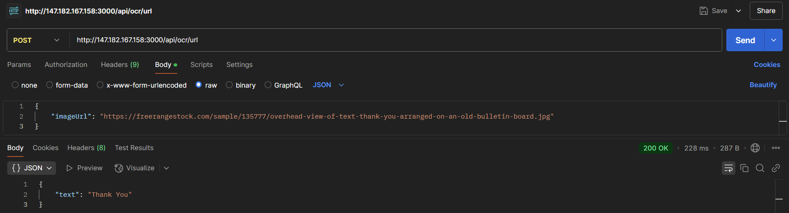
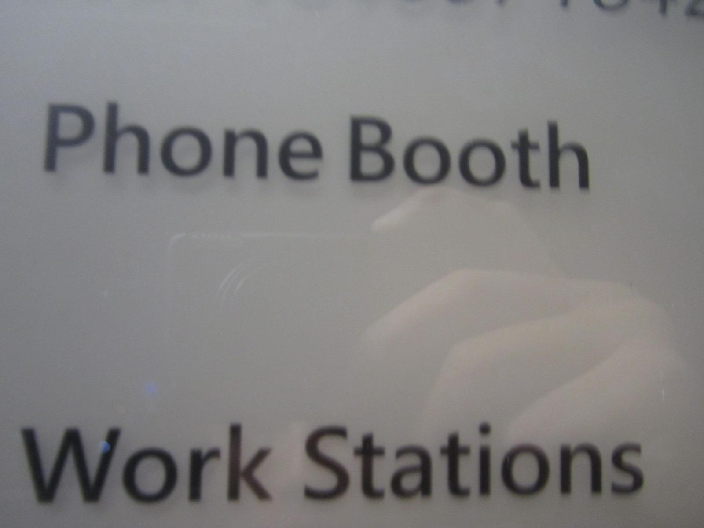
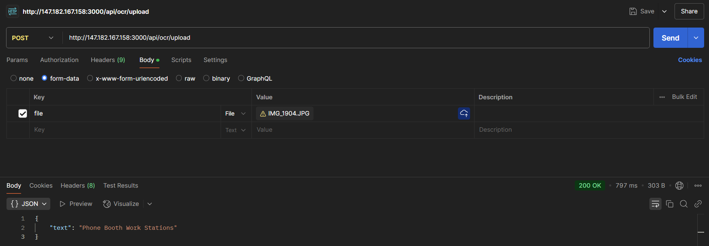

# API Wrapper User Guide

## Summary of API
This is a simple API Wrapper for Optical Character Recognition (OCR) using Microsoft’s Azure Optical Character Recognition service. It takes an image URL or file as input, applies Azure OCR to detect and extract text, and returns the recognized text in plain JSON format. Comprehensive error handling is included for invalid input, unsupported files, and Azure service failures.

- Base URL: `http://147.182.167.158:3000/api/ocr`
- Endpoints:
  - `POST /url`: For submitting an image URL.
  - `POST /upload`: For direct image upload.

## Examples

### Example 1: OCR with Image URL
Original Image:


Extracted Text:  



### Example 2: OCR with Image Upload
Original Image:



Extracted Text:  



<!-- ## Use Cases
- **Use Case 1**: Automating data retrieval for reporting.
- **Use Case 2**: Simplifying user authentication workflows.
- **Use Case 3**: Integrating with third-party systems.

## How to Use the Endpoints
### Endpoint A: `/endpoint-a`
1. **Purpose**: Retrieve data based on specific criteria.
2. **Steps**:
    - Send a `GET` request to `/endpoint-a`.
    - Include the required parameters in the query string.
    - Example: `GET /endpoint-a?param1=value1&param2=value2`.

### Endpoint B: `/endpoint-b`
1. **Purpose**: Submit data for processing.
2. **Steps**:
    - Send a `POST` request to `/endpoint-b`.
    - Include the required payload in the request body.
    - Example:
      ```json
      {
         "key1": "value1",
         "key2": "value2"
      }
      ```

## Swagger Documentation
For detailed technical information, refer to the [Swagger Documentation](path/to/swagger-docs). It includes:
- Expected input and output formats.
- Error codes and their meanings.
- Testing UI for trying out the endpoints. -->
